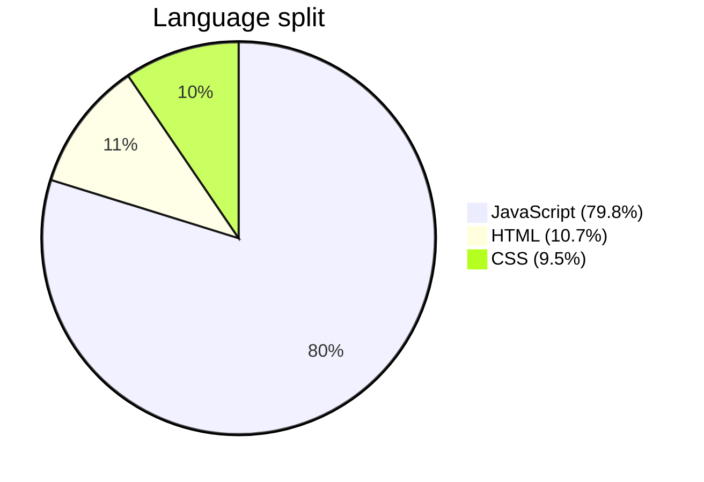
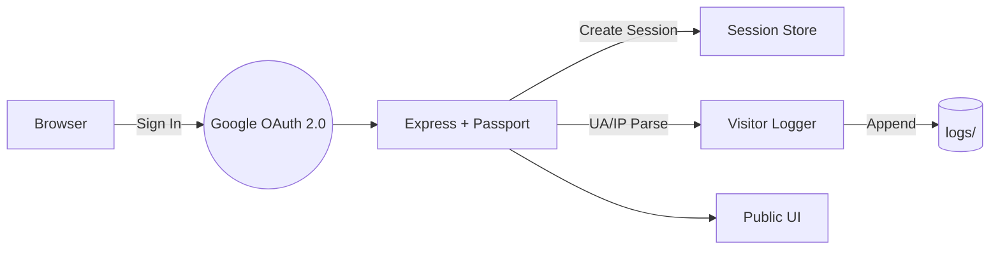
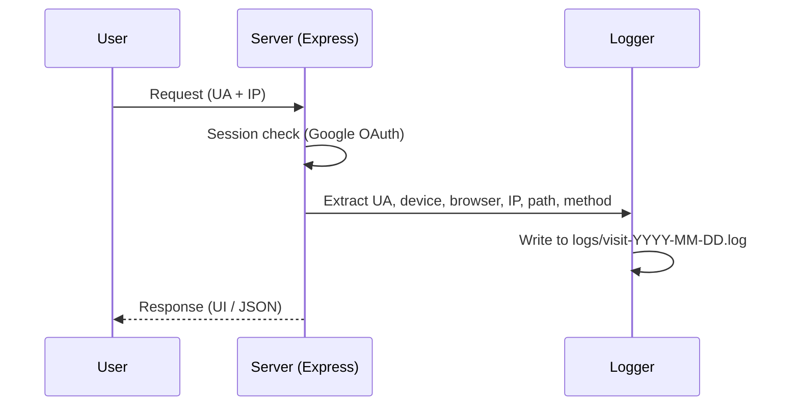

# Web Visitor Tracker 🚀👀

Secure Google OAuth 2.0 login + automatic visitor logging (device, browser, IP/location) + a stylish animated UI. Built with Node.js and Express as a portfolio‑ready, production‑style template.

[Open the repo](https://github.com/AshmitThakur23/Web-Visitor-Tracker-) • Issues • PRs


---

## Why this is impressive for recruiters/HR 🌟

- 🔐 Real OAuth 2.0 with sessions (shows security + auth skills).
- 🧭 Automatic analytics: device/browser/IP, timestamps, and routes.
- 🎨 Polished animated UI and clean UX.
- 🧰 Clear structure, logs directory, environment configs, and scripts.
- 📈 Designed to be extended to charts, dashboards, and databases.

---

## Visual Preview 🎥

<p align="center">
  
  <br/>
  <em>Elegant landing page with Google Sign‑In and subtle animations.</em>
</p>

<p align="center">
  
  <br/>
  <em>Authenticated dashboard after OAuth — shows profile and quick actions.</em>
</p>

<p align="center">
  
  <br/>
  <em>Visit logs: timestamp, user, device/browser, IP/location.</em>
</p>

<p align="center">
  
  <br/>
  <em>Refined interactions and motion for a modern, professional feel.</em>
</p>

## Tech at a glance 🛠️

- Backend: Node.js + Express
- Auth: Passport + Google OAuth 2.0
- UI: Vanilla HTML/CSS/JS with animations (served from `public/`)
- Logging: File‑based logs under `logs/` (easy to swap for DB)
- Config: `.env`

### Language composition


---

## Architecture 🧭



- Middleware reads User‑Agent and IP (and can enrich with geolocation).
- Logs are append‑only files (rotate daily) and ready for analytics ingestion.

---

## Project structure 📁

```
Web-Visitor-Tracker-/
├─ logs/                   # Visit logs (append-only)
├─ node_modules/
├─ public/                 # Static UI (HTML/CSS/JS)
├─ src/                    # Express app, routes, auth, logger
├─ .env                    # Local environment variables
├─ README.md
├─ package.json
├─ package-lock.json
├─ Screenshot 2025-10-23 224623.png
├─ Screenshot 2025-10-23 224804.png
├─ Screenshot 2025-10-23 224813.png
└─ Screenshot 2025-10-23 225750.png
```

---

## Quick start 🚀

1) Clone and install
```bash
git clone https://github.com/AshmitThakur23/Web-Visitor-Tracker-.git
cd Web-Visitor-Tracker-
npm install
```

2) Create a Google OAuth Client
- Open the [Google Cloud Console](https://console.cloud.google.com/).
- Create OAuth 2.0 credentials (Web application).
- Authorized redirect URI (local):
  - http://localhost:3000/auth/google/callback

3) Configure `.env`
```dotenv
PORT=3000
SESSION_SECRET=super-secure-session-secret

GOOGLE_CLIENT_ID=your_google_client_id
GOOGLE_CLIENT_SECRET=your_google_client_secret
GOOGLE_CALLBACK_URL=http://localhost:3000/auth/google/callback
```

4) Run
```bash
# if dev script exists (nodemon)
npm run dev

# or standard start
npm start
```
Open http://localhost:3000 and sign in with Google.

---

## Core routes 🔌

- GET `/` — Landing page
- GET `/dashboard` — Protected (requires Google login)
- GET `/auth/google` — Start OAuth
- GET `/auth/google/callback` — OAuth callback
- GET `/logout` — End session and redirect

---

## Visit logging 📘



Logged fields (typical):
- `timestamp`, `userId/email` (if authenticated)
- `ip`, `userAgent`, parsed `device`/`browser`
- `method`, `path`, optional geolocation

---

## Security notes 🔒

- Keep `SESSION_SECRET` strong and private.
- Never commit real secrets (.env) to Git.
- Use HTTPS and secure cookies in production.
- Add rate‑limits and input sanitization for public routes.

---

## What I built and learned 💡

- Implemented Google OAuth 2.0 with robust session handling.
- Built a clean logging pipeline suitable for dashboards/analytics.
- Designed an animated, responsive UI that feels modern and welcoming.
- Structured the project for maintainability and future growth.

---

## Roadmap 🗺️

- [ ] Built‑in charts (Chart.js) for visits over time, device mix
- [ ] Admin log viewer with search and filters
- [ ] Log rotation + centralized storage (MongoDB/Postgres/ClickHouse)
- [ ] Dockerfile + CI/CD + production reverse proxy (Nginx)
- [ ] IP geolocation via ipinfo/MaxMind

---

## Hire‑me highlights 🙋‍♂️

- Security‑aware authentication and session management
- Practical analytics mindset and clean data logging
- Strong UI polish + attention to detail
- Clear documentation and developer experience

---

## Contact

- Author: [Ashmit Thakur](https://github.com/AshmitThakur23)
- Repo: [Web Visitor Tracker](https://github.com/AshmitThakur23/Web-Visitor-Tracker-)

If you find this template helpful, please ⭐ the repository. It helps recruiters discover it too! ✨
