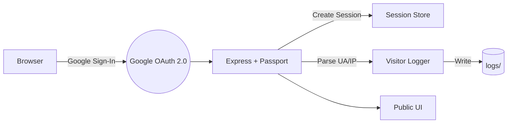
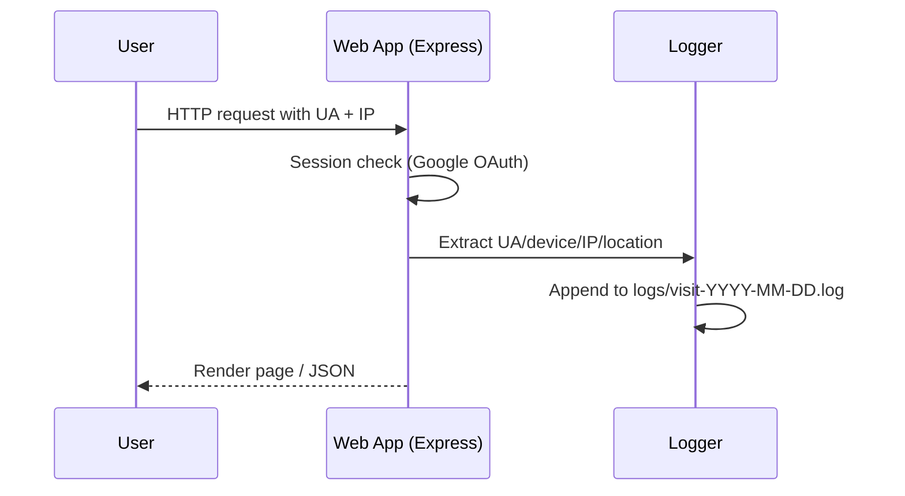

# Web Visitor Tracker 🚀👀

A modern Node.js + Express application with secure Google OAuth 2.0 login, automatic visitor logging (device, browser, IP/location), and a stylish animated UI. Perfect as a ready-to-use template for authentication and user analytics in web projects.

[Project Board](#) • [Issues](../../issues) • [Pull Requests](../../pulls)


---

## 🌟 What makes this project stand out (for recruiters)

- 🔐 Production-style Google OAuth 2.0 login with session security.
- 🧭 Automatic visit tracking: who logged in, when, device/browser, and location/IP.
- 🎨 Polished, animated front-end for a delightful first impression.
- 🧰 Clean folder structure, logs directory, environment-based config, and clear docs.
- 📈 Extensible analytics hooks to send events to files/DBs later.

---

## 🎬 Visual Preview

<p align="center">
  
  <br/>
  <em>Elegant landing with Google Sign-In and subtle animations.</em>
</p>

<p align="center">
  
  <br/>
  <em>User dashboard after OAuth — shows profile and quick actions.</em>
</p>

<p align="center">
  
  <br/>
  <em>Visitor logs: timestamp, device, browser, IP/location for insights.</em>
</p>

Tip: Filenames include spaces; they are URL‑encoded in the paths above so the images render correctly on GitHub.

---

## 🧭 Architecture at a glance



- Auth: Google OAuth 2.0 via Passport strategy.
- Sessions: Cookie-based session management with a secret.
- Logging: Middleware extracts device, browser (User‑Agent), IP and optional geolocation; writes to `logs/`.
- UI: Static assets from `public/` with smooth animations.

---

## 🗂️ Project Structure

```
Web-Visitor-Tracker-/
├─ .vscode/                # Dev tooling (optional)
├─ logs/                   # JSON/NDJSON/text logs of visits
├─ node_modules/           # Dependencies
├─ public/                 # Static assets (HTML/CSS/JS)
├─ src/                    # Server-side code (Express, routes, auth, logger)
├─ .env                    # Local environment variables (not committed in prod)
├─ README.md
├─ package.json
├─ package-lock.json
├─ Screenshot 2025-10-23 224623.png
├─ Screenshot 2025-10-23 224804.png
└─ Screenshot 2025-10-23 224813.png
```

---

## ⚙️ Tech Stack

- Backend: Node.js + Express
- Auth: Passport + Google OAuth 2.0
- UI: Vanilla HTML/CSS/JS with subtle animations
- Logging: File-based logs (extensible to DB/analytics)
- Environment Config: `.env`

---

## 📊 Feature Overview

- ✅ Google OAuth 2.0 login (secure, familiar, fast)
- ✅ Session handling with secret-based cookies
- ✅ Visitor analytics (time, UA/device, browser, IP/location)
- ✅ Animated, responsive front-end
- ✅ Clean logs for audit/insight

---

## 🚀 Quick Start

1) Clone and install
```
git clone https://github.com/AshmitThakur23/Web-Visitor-Tracker-.git
cd Web-Visitor-Tracker-
npm install
```

2) Create a Google OAuth 2.0 Client
- Visit the [Google Cloud Console](https://console.cloud.google.com/)
- Create OAuth credentials
- Authorized redirect URI example:
  - http://localhost:3000/auth/google/callback

3) Configure environment (.env)
```
PORT=3000
SESSION_SECRET=super-secure-session-secret

GOOGLE_CLIENT_ID=your_google_client_id
GOOGLE_CLIENT_SECRET=your_google_client_secret
GOOGLE_CALLBACK_URL=http://localhost:3000/auth/google/callback
```

4) Run the app
```
# Development (if nodemon is configured)
npm run dev

# or Standard start
npm start
```

Open http://localhost:${PORT} and sign in with Google.

---

## 🔐 Security Notes

- Keep `SESSION_SECRET` long and random.
- Never commit real `.env` secrets to source control.
- In production, set HTTPS and secure cookies.
- Rate-limit sensitive routes and sanitize logs.

---

## 🧪 How visit logging works



Logged fields typically include:
- timestamp, userId/email (if authenticated), IP, user-agent
- device/browser info, path, method
- derived location (if enabled)

---

## 🔌 Key Routes (typical)

- GET `/` — Landing page
- GET `/dashboard` — Authenticated area (requires login)
- GET `/auth/google` — Start Google OAuth
- GET `/auth/google/callback` — OAuth callback
- GET `/logout` — Destroy session and redirect

---

## 🧱 Extending this template

- Swap file logs for MongoDB/PostgreSQL/ClickHouse
- Add charting in UI (Chart.js) for visits over time
- Add admin-only log viewer with filters
- Add IP geo services (MaxMind, ipinfo, etc.)
- Deploy with Docker + Nginx reverse proxy + HTTPS

---

## ✅ Recruiter-Friendly Summary

- Demonstrates real-world auth + session + middleware patterns.
- Shows product sense: minimal, animated, and welcoming UI.
- Clean code organization and deployment-ready config.
- Easy to review and extend — ideal template for many web apps.

---

## 📄 License

This project is open for learning and portfolio use. You can adapt it for your needs. Add a formal license if required (e.g., MIT).

---

## 🙋‍♂️ Author

- Ashmit Thakur — [GitHub Profile](https://github.com/AshmitThakur23)

If this template helped you, please ⭐ the repo. Your support helps me keep improving projects like this!
